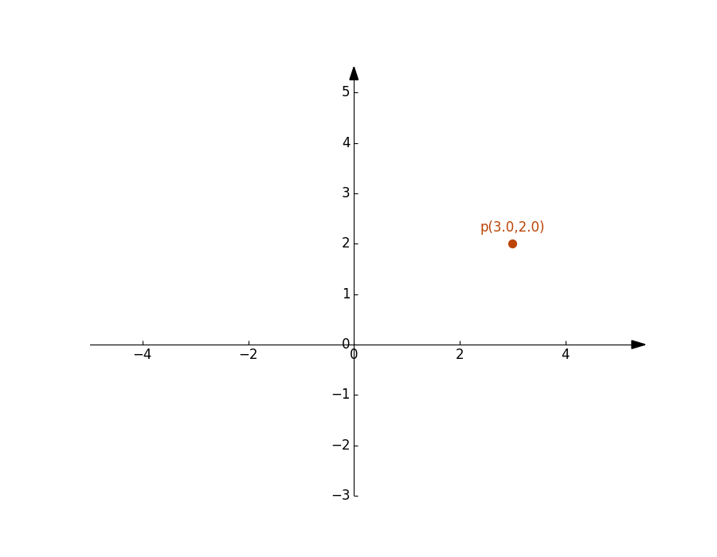
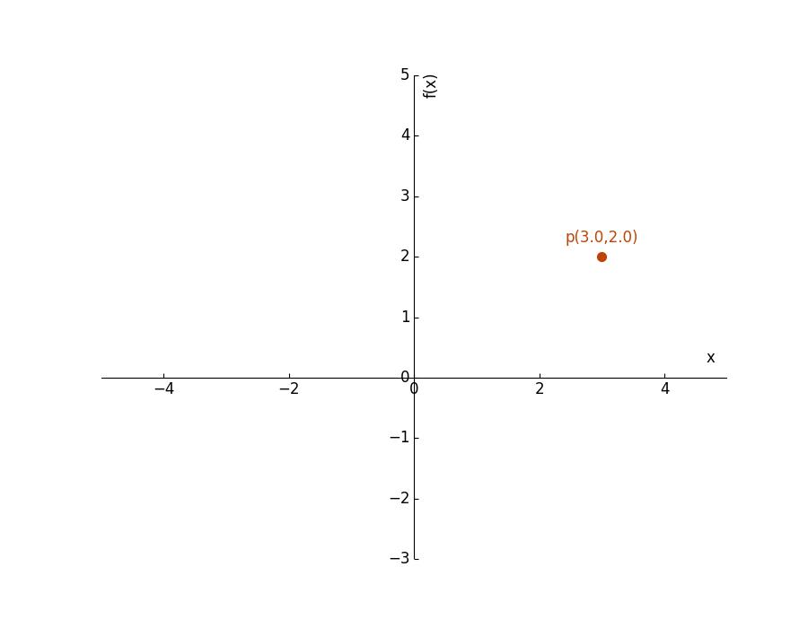
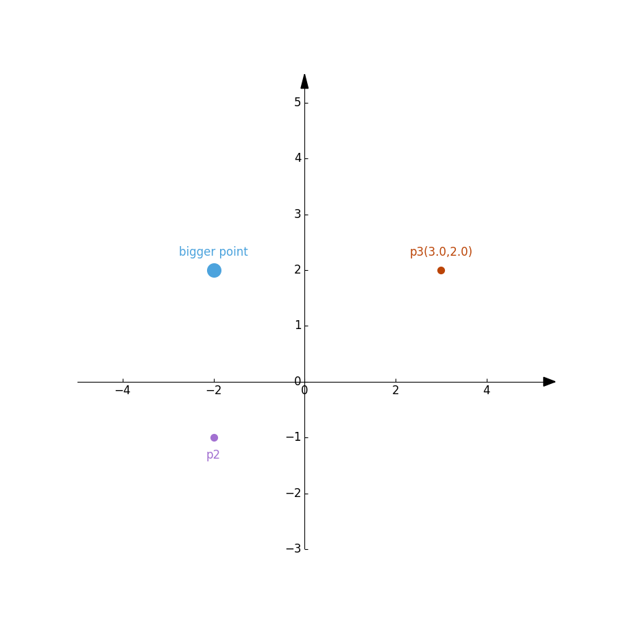
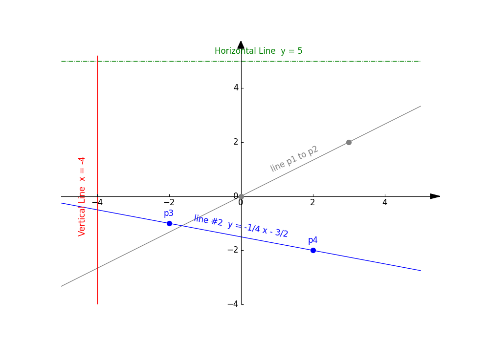
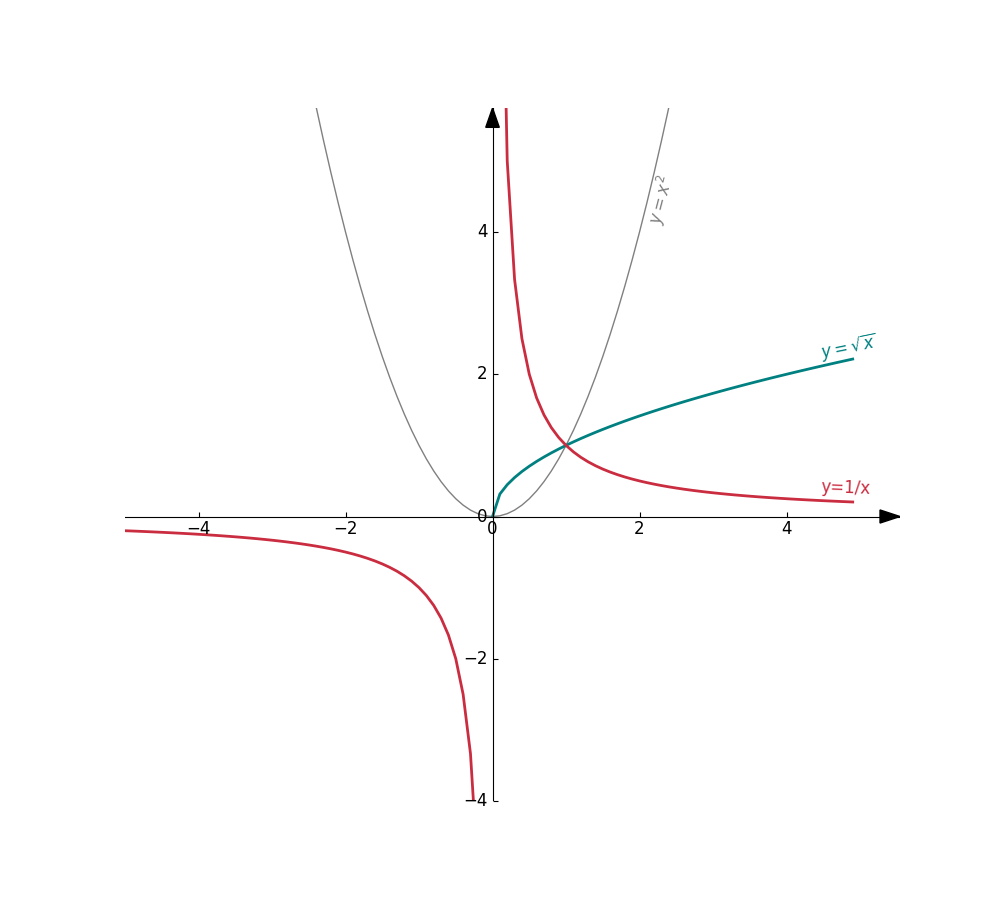

# pyGeom2D

Python package to create 2D geometries.

# 1- Getting Started

## 1.1 - Installation

Clone this repository and copy the <code>pygeom</code> directory where you are going to write your Python scripts or your Jupyter notebooks. Then you can simply import the module.


```python
import pygeom
```


# 2 - Usage Examples

You will find many more examples in the <code>notebook</code> sub-directory of this repo.

<br/>

## 2.1 - Cartesian coordinate axes + points

### Version 1: Classic, arrow-stype axes

```python
# Create the cartesian axis
axes = Axes(xlim=(-5,5), ylim=(-3,5), figsize=(9,7))

point = Point(3, 2, color='#bb4406', label='p', coords=True)

axes.add(point)
axes.draw()
```




### Version 2: Custom names for the axes

```python
# Create the cartesian axis
axes = Axes(xlim=(-5,5), ylim=(-3,5), figsize=(9,7), style=['x', 'f(x)'])

point = Point(3, 2, color='#bb4406', label='p', coords=True)

axes.add(point)
axes.draw()
```




## 2.2 Annotated Points Demo

```python
# Create the cartesian axis
axes = Axes(xlim=(-5,5), ylim=(-3,5), figsize=(9,9))

p1 = Point(-2,  2, size=200, label='bigger point')
p2 = Point(-2, -1, color='#a270d1', label='p2', loc='down')
p3 = Point( 3,  2, color='#bb4406', label='p3', coords=True)

axes.add(p1)
axes.addMany([p2, p3])
axes.draw()
```




## 2.3 Lines Demo

```python
# Create the cartesian axis
axes = Axes(xlim=(-5,5), ylim=(-4,5.2), figsize=(10,7))

# A grey line between two points p1 and p2
p1 = Point(0, 0, color='grey')
p2 = Point(3, 2, color='grey')
l1 = Line(p1=p1, p2=p2, label='line p1 to p2', color='grey')
axes.addMany([p1, p2, l1])

# A blue line between two points p3 and p4, this time give the points a label
p3 = Point(-2, -1, color='blue', label='p3')
p4 = Point( 2, -2, color='blue', label='p4')
l2 = Line(p1=p3, p2=p4, label='line #2', add_eq=True, color='blue')
axes.addMany([p3, p4, l2])

# This time define a green line with a slope and intercept
l3 = Line(slope=0.0, intercept=5.0, label='Horizontal Line', add_eq=True, color='green', linestyle='dashdot')
axes.add(l3)

# vertical line
l4 = Line(p1=Point(-4, -2), p2=Point(-4, 2), color='red', add_eq=True, label='Vertical Line', loc='left')
axes.add(l4)

axes.draw()
```




## 2.3 Custom Curves Demo

```python
import math
import numpy as np

from pygeom import Axes, Point, Curve

def f(x):
    y = math.pow(x, 2)
    return y

def g(x):
    if x < 0:
        y = np.nan
    else:
        y = math.sqrt(x)
    return y

def h(x):
    y = 1/x
    return y


# Create the cartesian axis
axes = Axes(xlim=(-5,5), ylim=(-4,5.2), figsize=(10,9))

# Curve of y = x^2
c1 = Curve(f, label=r'$y=x^2$', color='grey')
axes.add(c1)

# Curve of y = sqrt(x)
c2 = Curve(g, label=r'$y=\sqrt{x}$', linewidth=2, color='#008080')
axes.add(c2)

# Curve of y = 1/x
c3 = Curve(h, x_disc=[0.0], label='y=1/x', linewidth=2, color='#ca2c40')
axes.add(c3)

axes.draw()
```




